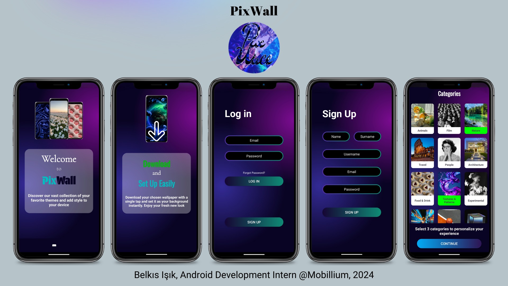
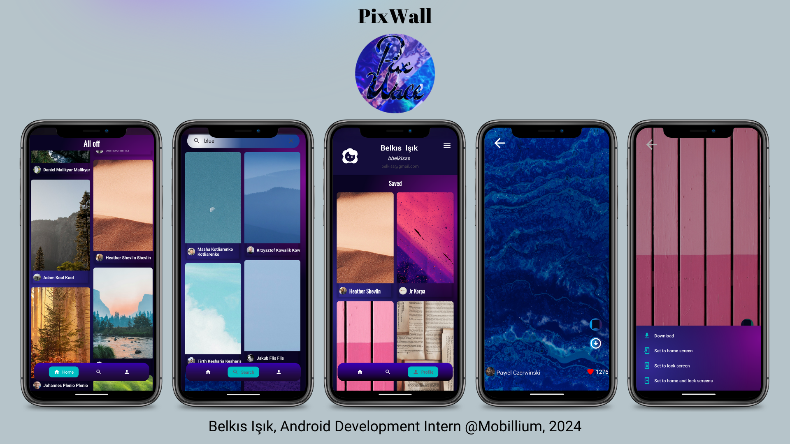

## Pix Wall - Wallpaper Application
Pix Wall is a mobile application that uses the Unsplash API to list high-quality wallpapers and allows users to access detailed information about these images. Users are directed to the detail page by clicking on a listed image. On the detail page, users can save, download, or set the image as their device's background.

## Technologies Used
1-Unsplash API: Used to list high-quality images and retrieve their details.
2-Firebase: Used for user authentication and storing data in Firestore.
3-Firestore: Used to store user data, favorites, and selected categories.
4-ViewPager2: Used for navigating between pages within the app.
5-Chip Navigation Bar: A library from GitHub used for quick access to categories.
6-Retrofit: Used to perform network requests with the API.
7-Glide: Used for fast and efficient image loading.
8-Navigation Component: Used for fragment transitions and data passing.
9-Coroutines: Used to perform asynchronous operations without blocking the UI thread.
10-Wallpaper Manager: Allows users to directly set an image as their device's background.
11-Download Manager: Allows users to download and save the image from the detail page to their device.
12-Firebase Authentication: Used for user login.
13-Firestore: Used to store users' selected categories and favorites.

## Application Features
-Listing and Detail Page: On the main screen, wallpapers fetched from the Unsplash API are listed. When any image is clicked, it transitions to the detail page.
-Save and Download: Users can save the image displayed on the detail page to their device or download it using the Download Manager.
-Set as Background: With Wallpaper Manager, users can set the image as their device's background with one click.
-User Login and Categories: After logging in, users can select categories. These categories are stored in Firestore and listed on the main page. Content is displayed based on the categories selected by the user.
-Profile Page: The data saved by the user is shown on the profile page.
-Asynchronous Data Management: The app manages data from the API efficiently and performantly with Koin and Coroutines.

## Libraries
Firebase, Retrofit, Glide, Koin, Navigation Component, Coroutines
OkHttp, Gson, ViewPager2, Chip Navigation Bar, BlurView

## UI 

    
